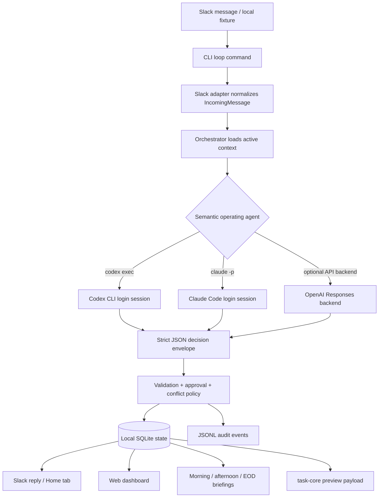
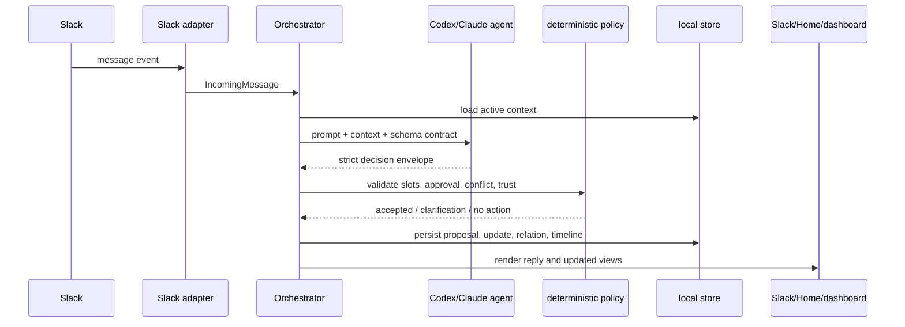

# Agent Flow Overview

This page is a codeboarding-style map of where the semantic CLI agent enters the system and where deterministic code takes over. It is intentionally high-level so a new operator can understand the runtime before connecting a real Slack workspace.

## One-line model

Slack delivers messages; Codex or Claude Code interprets intent; this repository validates, persists, renders, and replies.

```text
Slack event / transcript
  -> task_management.cli live-loop command
  -> Slack adapter normalizes the message
  -> TaskManagementOrchestrator.handle_message(...)
  -> Codex/Claude operating agent returns a strict decision envelope
  -> deterministic policy validates and applies the decision
  -> local SQLite + JSONL audit state
  -> Slack reply, Home/dashboard views, task-core preview payload
```

## Runtime intervention points

| Stage | Main files | Who decides? | What happens |
| --- | --- | --- | --- |
| Intake | `task_management/cli.py`, `task_management/slack_socket.py`, `task_management/slack_adapter.py` | Deterministic adapter | Slack Socket Mode, fast-cycle polling, or local transcript fixtures are normalized into `IncomingMessage` objects. |
| Context assembly | `task_management/orchestrator.py`, `task_management/semantic_context.py`, `task_management/store.py` | Deterministic code | The runtime loads active proposals, pending approvals, relations, and recent audit context for the message. |
| Semantic decision | `task_management/codex_operating_agent.py`, `task_management/claude_code_operating_agent.py`, `task_management/openai_operating_agent.py`, `task_management/operating_agent.py` | Codex / Claude / OpenAI semantic agent | The agent classifies whether the message creates work, updates existing work, asks for clarification, or requires no action. The output must match the strict JSON decision schema. |
| Safety gate | `task_management/orchestrator.py`, `task_management/approval_policy.py`, `task_management/slot_validator.py`, `task_management/conflict_policy.py` | Deterministic code | The repository rejects malformed decisions, asks for missing slots, blocks risky auto-approval, and prevents unsafe state writes. |
| State and history | `task_management/store.py`, `task_management/relations.py`, `task_management/timeline.py` | Deterministic code | Proposals, subtasks, parent/child relations, timeline events, and audit JSONL entries are persisted locally. |
| Human surfaces | `task_management/slack_home.py`, `task_management/secretary.py`, `task_management/frontend.py`, `task_management/human_view.py` | Deterministic renderer | Slack replies, Home tab content, briefings, hierarchy views, and dashboard HTML are generated from state. |
| External preview | `task_management/task_core_bridge.py` | Deterministic bridge | The system builds and validates preview-only `task-core.export.v1` payloads without writing task-core inbox/raw/wiki files. |

## Mermaid overview



## Sequence for a new message



## Agent contract

The semantic agent should answer questions such as:

- Is this a new task, event, routine, reference, or just conversation?
- Does it update an existing proposal or subtask?
- Which fields are known, uncertain, or missing?
- Is the decision safe to auto-apply, or should the user approve it first?
- What evidence in the message/context supports the decision?

The deterministic layer is not a passive executor. It is responsible for refusing invalid envelopes, applying approval policy, preserving auditability, and keeping the local runtime safe.

## Choosing the backend

Use one of these local environment choices:

```powershell
$env:TASK_MANAGEMENT_OPERATING_AGENT = "codex"
$env:TASK_MANAGEMENT_CODEX_MODEL = "gpt-5.5"
```

or:

```powershell
$env:TASK_MANAGEMENT_OPERATING_AGENT = "claude"
$env:TASK_MANAGEMENT_CLAUDE_MODEL = "sonnet"
$env:TASK_MANAGEMENT_CLAUDE_FALLBACK = "0"
```

The login-session modes use the operator's local CLI login. Do not commit API keys, Slack tokens, transcripts, local databases, or generated dashboards.
