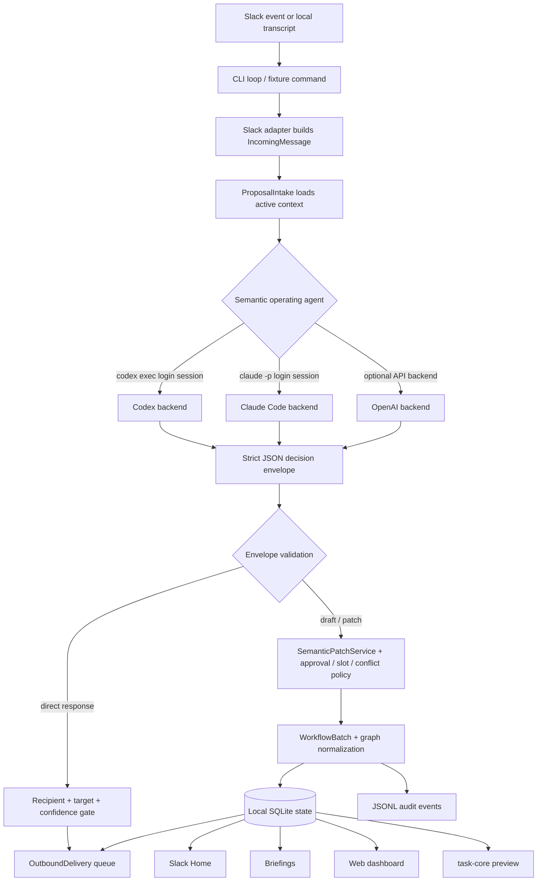
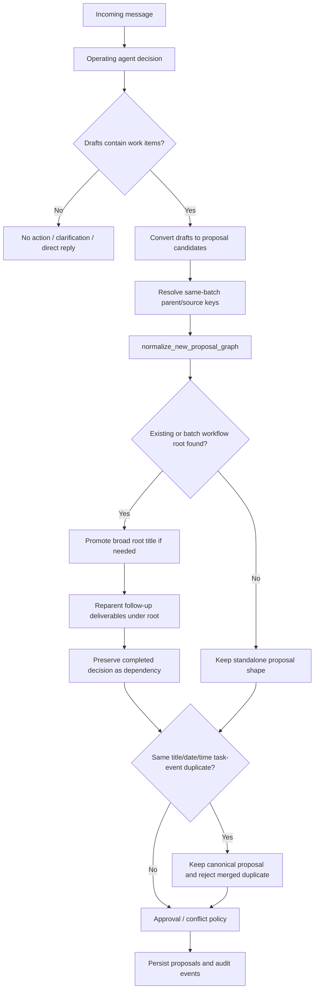
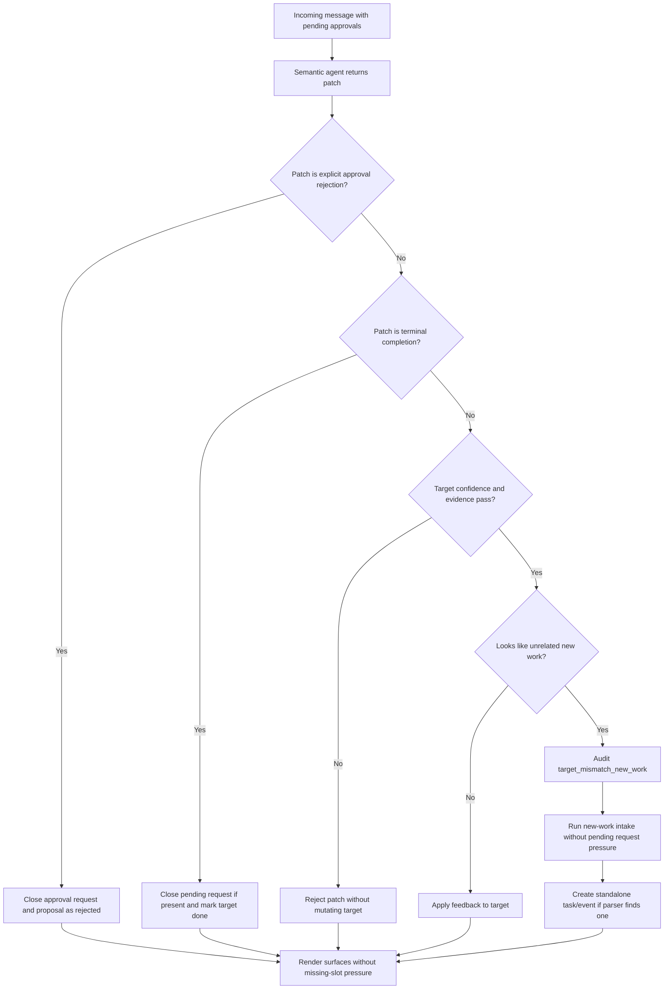
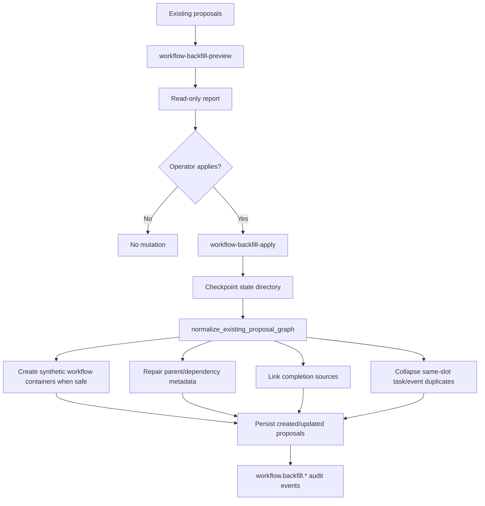
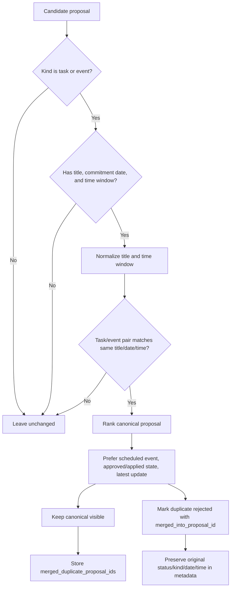
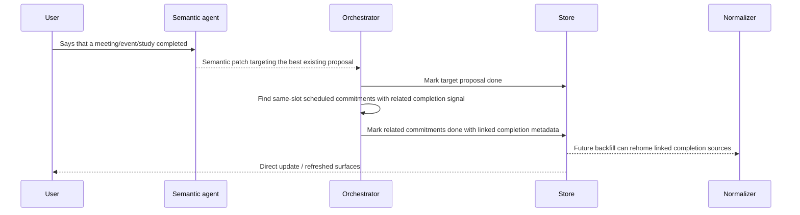
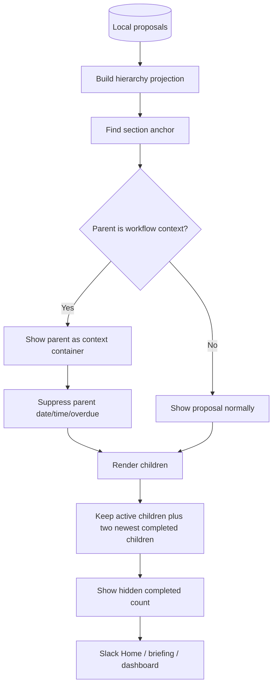
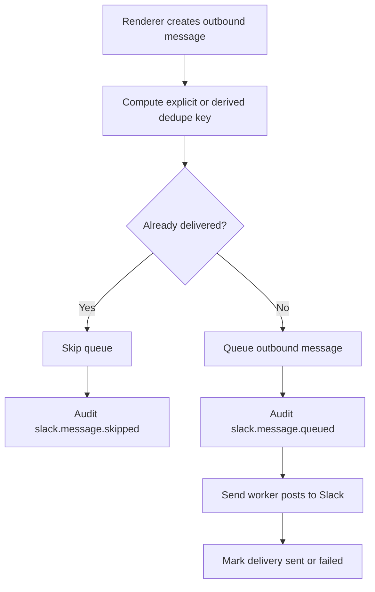
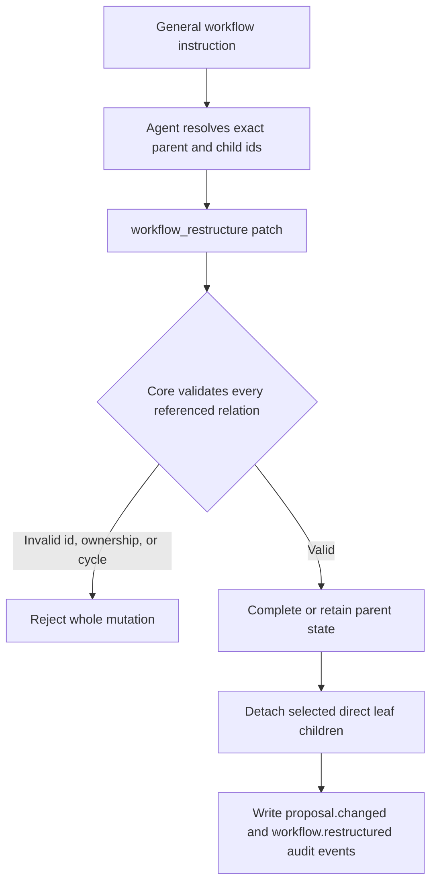

# Agent Flow Overview

This document is the curated runtime map for the clean public task-management repository. It explains where a semantic CLI agent intervenes, where deterministic code takes over, and how the current workflow/hierarchy rules reshape tasks after the agent returns a decision.

For a rendered version of this document, open [`docs/agent-flow.html`](agent-flow.html). For a playable animation, open [`docs/agent-flow-demo/index.html`](agent-flow-demo/index.html). For static code inventory evidence, start at [`docs/codeboarding/README.md`](codeboarding/README.md). For cross-agent refactoring handoffs, read and update [`docs/shared-context.md`](shared-context.md). This page is different: it is the operator-facing control-flow and policy map.

## Current one-line model

Slack or a local fixture delivers a message; Codex or Claude Code interprets intent; deterministic orchestration validates the strict decision envelope, normalizes workflow hierarchy, persists local state, renders human views, and optionally builds a task-core preview payload.

```text
Slack event / local transcript
  -> CLI loop or fixture command
  -> Slack adapter normalizes IncomingMessage
  -> ProposalIntake and orchestrator load proposal, approval, relation, timeline, and audit context
  -> Codex / Claude / OpenAI operating agent returns a strict decision envelope
  -> SemanticPatchService plus deterministic validation, approval, conflict, and slot policy
  -> WorkflowBatch and graph normalizer repair parent/root/dependency structure
  -> Local SQLite state plus JSONL audit events
  -> OutboundDelivery, Slack Home, briefings, web dashboard, task-core preview
```

## What changed in the current flow

The older flow treated the semantic decision as mostly create/update followed by policy and persistence. The current flow has additional deterministic structure around workflow lifecycles:

0. **Thin orchestrator, focused services.** The main orchestrator now delegates proposal intake, semantic patch application, approval transitions, workflow batch handling, completion linking, outbound delivery, source/channel reference handling, and time parsing to focused modules instead of carrying those responsibilities inline.
1. **Stable workflow root.** Study, meeting, event, and review lifecycles should converge on a broad workflow root for the actual named event, not a narrow planning step such as a schedule decision or prep discussion.
2. **New-input normalization.** After the operating agent proposes a new item, `normalize_new_proposal_graph(...)` can promote an existing planning parent into a workflow root and reparent post-event deliverables under that root before persistence.
3. **Workflow backfill.** Existing state can be repaired with `workflow-backfill-preview` and `workflow-backfill-apply`; the apply path checkpoints state first and writes audit events for created or updated workflow graph items.
4. **Linked completion.** When a semantic completion update closes one scheduled event, related scheduled commitments in the same slot can be completed and linked as completion evidence.
5. **Surface rollup.** Slack Home, briefings, and the web dashboard anchor child items under workflow context parents, suppress parent-only dates/overdue flags, show only the two most recent completed children, and show hidden-completed counts.
6. **Outbound dedupe audit.** Duplicate outbound Slack cards are skipped through stable dedupe keys and now emit an explicit `slack.message.skipped` audit event with reason `duplicate_dedupe_key`.
7. **Task/event commitment collapse.** If the same commitment is represented twice as a task and an event with the same normalized title, date, and time window, the normalizer keeps one canonical visible proposal and marks the duplicate as a rejected merge record with `merged_into_proposal_id`.
8. **Rejected-work surface boundary.** Rejected proposals remain in audit/status counts, but a shared `is_surface_visible_item(...)` gate keeps them out of current schedules, pending confirmation cards, hierarchy children, Slack digests, Home, briefings, monthly pages, and the web dashboard.
9. **Terminal completion with unresolved slots.** A semantic completion update can close an item even when the date or time was never resolved. If the completion is scoped to a pending request, the request is closed first and then the target proposal is marked done.
10. **Pending-card hijack protection.** A lone pending clarification no longer owns every later private message. The deterministic layer accepts explicit rejections, checks semantic target evidence, and reroutes unrelated meeting-like patches through new-work intake.
11. **Provider-generic outbound path.** Renderers create `OutboundMessage` objects; `outbound_delivery.py` handles queue/send/dedupe flow behind a provider transport so Slack remains a thin wrapper rather than the architecture center.
12. **Runtime resilience.** Socket reconnect backoff, fast-cycle guards, deferred reminder ticking, and transient Slack send retries keep clean deployments closer to the live operating shape without committing live state.
13. **Shared engineering memory.** Refactoring handoffs should update `docs/shared-context.md` with public-safe decisions, verification, and watchpoints so Codex, Claude Code, and human maintainers share the same current context.
14. **General existing-work restructuring.** A private natural-language request can complete or retain an umbrella item while detaching explicitly named direct leaf children as standalone work. Exact IDs, current ownership, lifecycle state, pending approvals, nesting, and audit persistence remain deterministic safety gates.
15. **State-preserving direct answers.** Explanation, status, reason, and “what should I do?” questions use a strict `direct_responses` envelope. The core validates the private-DM recipient, referenced proposal/request IDs, and confidence, then replies without mutating task or approval state.

## Runtime intervention points

| Stage | Main files | Who decides? | Current behavior |
| --- | --- | --- | --- |
| Intake | `task_management/cli.py`, `task_management/slack_socket.py`, `task_management/slack_adapter.py`, `task_management/channels.py`, `task_management/source_refs.py` | Deterministic adapter | Socket Mode, polling, fixture, and CLI commands become `IncomingMessage` objects. Channel-specific id and source-reference semantics are centralized before persistence or dedupe. |
| Context assembly | `task_management/orchestrator.py`, `task_management/proposal_intake.py`, `task_management/semantic_context.py`, `task_management/store.py` | Deterministic code | The orchestrator remains a coordinator while proposal intake and context assembly load active proposals, pending approvals, relations, recent audit evidence, and current workflow context. |
| Semantic decision | `task_management/codex_operating_agent.py`, `task_management/claude_code_operating_agent.py`, `task_management/openai_operating_agent.py`, `task_management/operating_agent_prompt.py` | Codex / Claude / OpenAI semantic agent | The agent classifies no-action vs create vs update vs read-only response vs clarification, chooses semantic target candidates, and returns a strict JSON envelope. It is explicitly instructed to prefer stable workflow roots for event lifecycles. |
| Envelope and policy gate | `task_management/orchestrator.py`, `task_management/semantic_patch_service.py`, `task_management/approval_flow.py`, `task_management/approval_policy.py`, `task_management/slot_validator.py`, `task_management/conflict_policy.py`, `task_management/feedback_scoring.py` | Deterministic code | Invalid decisions are refused; direct responses are checked for private recipient, accessible target IDs, and confidence; mutations still pass target evidence, missing-slot, approval, risk, conflict, and workflow gates. Explicit semantic rejection patches close approvals; low-evidence unrelated patches are rerouted as new work. |
| Workflow graph normalization | `task_management/workflow_normalizer.py`, `task_management/workflow_batch.py`, `task_management/relations.py`, `task_management/completion_linker.py`, `task_management/prep_subtasks.py` | Deterministic code, seeded by semantic evidence | New drafts and selected existing graphs are normalized around canonical workflow roots, parent/child relations, dependency edges, linked completion evidence, prep subtasks, and task/event duplicate commitments. |
| State and history | `task_management/store.py`, `task_management/timeline.py`, `task_management/backfill_report.py` | Deterministic code | Proposals, approval requests, parent/child metadata, dependencies, timeline entries, outbound deliveries, and audit JSONL events are stored locally. Multi-proposal hierarchy changes and their audit rows share a transactional outbox. |
| Human surfaces | `task_management/slack_home.py`, `task_management/secretary.py`, `task_management/frontend.py`, `task_management/human_view.py`, `task_management/hierarchy_view.py`, `task_management/work_item_state.py`, `task_management/sort_keys.py`, `task_management/korean_time.py` | Deterministic renderer | Slack replies, Slack Home, morning/afternoon/EOD briefings, and dashboard pages render hierarchy-aware work items with overdue sorting, shared Korean time parsing, and compact completed-child display. |
| Outbound delivery | `task_management/outbound_delivery.py`, `task_management/slack_adapter.py`, `task_management/chat_adapter.py` | Deterministic provider wrapper | Queue, send, retry, failure audit, provider message id capture, and dedupe are handled through a transport seam; Slack remains one provider implementation. |
| External preview | `task_management/task_core_bridge.py` | Deterministic bridge | The repo builds and validates preview-only `task-core.export.v1` payloads. It does not write task-core inbox/raw/wiki state. |

## End-to-end message flow



## New input hierarchy flow



## Semantic target safety flow



Practical interpretation:

- A reply such as `reject approval/...` or a semantic `status=rejected` patch is a terminal approval decision, not an unsupported status update.
- A completion patch is also terminal: it can close a pending request and mark the target done even when the original item was missing a date or time.
- A message with a concrete time/place and meeting-like wording must not mutate an unrelated pending question unless it also carries credible target evidence.
- If the semantic agent over-targets the pending card, deterministic code records the mismatch and gives the same message a second chance as a new item.
- Rejected proposals are audit records, not active work: they stay available for counts/history but do not render as current schedule items, pending cards, or hierarchy children.
- Rejected and done proposals are excluded from task-core preview readiness rather than appearing as blocked work.
- Plain `question` proposals do not need dates unless the source item explicitly asks for exact-date resolution.

### Practical interpretation

If a narrow item such as a review discussion or schedule decision later turns out to be part of a broader named event, the broad event becomes the anchor. Follow-up materials, reports, minutes, result sharing, and outbound email attach to that workflow root or nearest active workflow ancestor. Completed planning or schedule-decision items remain visible as completed dependencies, not as the parent of later post-event deliverables.

## Existing-state backfill flow



Backfill is deliberately more conservative than new-input normalization. It repairs already-linked workflow subtrees, canonical event roots, multi-parent metadata, dependency-only workflow containers, and linked completion evidence. It should not sweep unrelated historical tasks under a workflow based only on weak keyword overlap.

## Task/event duplicate commitment collapse



This rule is intentionally narrow. It does not merge arbitrary similarly named work. It only collapses a visible duplicate when one proposal is a task, the other is an event, and both point to the same normalized title, same date, and same non-empty time window. New-input normalization runs this check before approval/outbound handling so a duplicate incoming proposal is stored as audit history instead of creating another approval card. Existing-state backfill runs the same check so old task/event splits converge to the same single visible commitment model.

## Completion and linked scheduled commitments



## Human surface rendering flow



Surface rules are intentionally consistent across Slack Home, proactive briefings, and the web dashboard:

- Active children stay visible.
- Completed children are shown with strikethrough-style titles where the surface supports it.
- Only the two most recent completed children are shown under a workflow parent.
- Older completed children are counted as hidden rather than expanding the current-work view.
- Parent workflow containers are context anchors, so their own date/time/overdue labels are suppressed when children exist.
- Current work sorts by deadline, with overdue work moved behind non-overdue same-section work where supported.
- Rejected items are suppressed from current-work sections and child rollups even if they still contribute to audit/status summaries.

## Outbound Slack and dedupe flow



Dry-run briefing commands do not consume dedupe keys. `morning-briefing` and `afternoon-briefing` also support a force path that appends a unique suffix when the operator deliberately wants to resend a briefing.

## Agent contract

The semantic agent should answer these questions and return them through the strict schema rather than free-form prose:

- Is the message no-action, a new work item, an update, a completion, a clarification answer, or a user-facing question?
- Which existing proposal or workflow root is the best semantic target?
- If this is a study, meeting, event, or review lifecycle, what is the stable workflow root?
- Is the item a parent workflow, child step, dependency, post-event deliverable, or completion evidence?
- Which slots are known, missing, deferred, or risky to auto-approve?
- What evidence text and confidence support the decision?
- Is this a read-only explanation/status request that must leave proposal and approval state unchanged?

The deterministic layer then decides whether the envelope is valid, whether approval is required, whether hierarchy should be normalized, and what should be persisted.

When refactoring this contract, update `docs/shared-context.md` with:

- the decision you changed,
- why deterministic safety still holds,
- which tests prove it,
- and any watchpoints for the next Codex or Claude Code session.

## Read-only request/answer path

Ordinary private-DM conversation about tasks, planning, app behavior, draft wording, or existing state may emit `action=respond` with one or more `direct_responses`. The core validates that each response goes back to the current private-DM sender, checks referenced proposal/request IDs when present, and applies the confidence gate without changing proposal or approval state. `[요청]` is optional and only adds the small `*[요청]*` marker when the literal tag is present; untagged messages render as normal conversation.

A single decision may contain both `direct_responses` and a real draft/patch. This allows the bot to explain what it understood and apply an explicitly requested correction in the same turn. Explanation text must never be hidden inside a rejected `needs_clarification` patch. If a semantic CLI times out, the conservative rule fallback may explain an exactly matched recent item, but it will ask for the target rather than guess.

## General existing-work requests

Private Slack DMs may express state changes that are broader than a date or status update. The semantic agent should treat requests such as “complete this umbrella item but keep these unfinished children as standalone tasks” as feedback against existing proposals.



The supported deterministic operations are:

- `relation_action=detach_children`: remove selected direct children from the old workflow and keep their task state intact.
- Optional `status=done`: complete the old parent in the same validated operation.

This is deliberately more permissive at the language layer but not at the storage layer. The agent can understand varied natural-language instructions, while the core still requires exact existing IDs, current ownership, actionable lifecycle state, direct leaf-child ownership, and all-or-nothing proposal persistence. Reparenting and nested-workflow moves remain clarification-only until their approval migration semantics are explicit.

## Backend choices

Clean installs can use a local CLI login session instead of committed API keys.

```powershell
$env:TASK_MANAGEMENT_OPERATING_AGENT = "codex"
$env:TASK_MANAGEMENT_CODEX_MODEL = "gpt-5.5"
```

or:

```powershell
$env:TASK_MANAGEMENT_OPERATING_AGENT = "claude"
$env:TASK_MANAGEMENT_CLAUDE_MODEL = "sonnet"
$env:TASK_MANAGEMENT_CLAUDE_FALLBACK = "0"
```

Both backends are semantic engines behind the same strict decision contract. The rest of the repository remains deterministic: validation, normalization, persistence, dedupe, rendering, and task-core preview should behave the same regardless of which backend produced the decision envelope.

## Clean-public boundary

Do not commit Slack tokens, app tokens, local state databases, JSONL event logs, raw transcripts, local user identifiers, or generated dashboards containing live data. CodeBoarding and agent-flow docs are safe only when local absolute paths and live identifiers are sanitized.
