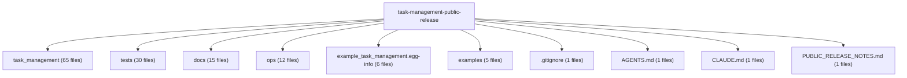

# Architecture Inventory: task-management-public-release

- Target repo: `<repo-root>`
- Generated at: `2026-08-05T01:17:03Z`
- Evidence source: deterministic static scan by `repo_inventory.py`

## Overview Diagram

## Evidence Summary

| Item | Value |
| --- | --- |
| Files scanned | 140 |
| Skipped paths | 16 |
| Entrypoints detected | 1 |
| Cheap dependency edges | 679 |

## Top-level Modules

| Item | Value |
| --- | --- |
| task_management | 65 files |
| tests | 30 files |
| docs | 15 files |
| ops | 12 files |
| example_task_management.egg-info | 6 files |
| examples | 5 files |
| .gitignore | 1 files |
| AGENTS.md | 1 files |
| CLAUDE.md | 1 files |
| PUBLIC_RELEASE_NOTES.md | 1 files |
| README.md | 1 files |
| pyproject.toml | 1 files |

## Languages

| Item | Value |
| --- | --- |
| HTML | 4 |
| JSON | 4 |
| Markdown | 18 |
| Python | 95 |
| Shell | 1 |
| TOML | 1 |

## Important Config Files

| Item | Value |
| --- | --- |
| .codex/skills/slack-canvas-task-page/SKILL.md | config/evidence |
| AGENTS.md | config/evidence |
| README.md | config/evidence |
| examples/README.md | config/evidence |
| pyproject.toml | config/evidence |

## Inference Notes

- Top-level modules are directory/file-count clusters, not necessarily domain boundaries.
- Dependency edges are cheap import edges and may miss dynamic imports, framework routing, or generated code.
- Machine-readable limits and synthesis rules are recorded in `inventory.json` under `analysis_limits`.

## Known Gaps

- Semantic architecture summaries require a Codex reasoning pass over this static inventory.
- Runtime flow is inferred only from manifest/config entrypoints in this first pass.
- Skipped secret/runtime-like paths were intentionally not read.
