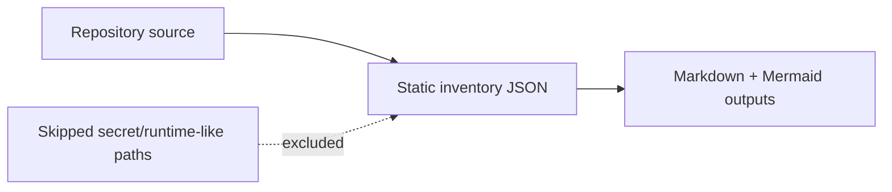

# Data Flow: task-management-public-release

- Target repo: `<repo-root>`
- Generated at: `2026-06-13T12:02:13Z`
- Evidence source: deterministic static scan by `repo_inventory.py`

## Inventory Data Flow

## Safety Exclusions

| Item | Value |
| --- | --- |
| .git/ | skipped |
| .pytest_cache/ | skipped |
| .env.example | skipped |
| .state-md/task_management.sqlite3 | skipped |
| docs/codeboarding/ | skipped |
| docs/screenshots/slack-app-settings/01-app-token-1-generate.png | skipped |
| docs/screenshots/slack-app-settings/01-app-token-2-scope.png | skipped |
| docs/screenshots/slack-app-settings/01-app-token-3-copy.png | skipped |
| docs/screenshots/slack-app-settings/05-install-2-token.png | skipped |
| ops/com.example.task-management.slack-secretary.plist.template | skipped |
| ops/slack-secretary-supervisor.sh | skipped |
| task_management/__pycache__/ | skipped |
| task_management/secretary.py | skipped |
| tests/__pycache__/ | skipped |
| tests/test_proactive_secretary.py | skipped |

## Inference Notes

- This document describes the inventory-generation data flow, not the target application's business data flow.
- Any application-level data-flow claims require a follow-up semantic pass grounded in safe source files.

## Known Gaps

- Application-level data stores and business data flows require a targeted semantic pass.
- Secret-like and runtime-state paths are intentionally excluded from generated documentation.
