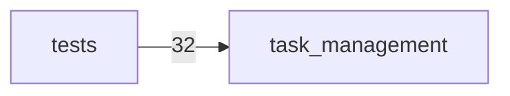

# Module Map: task-management-public-release

- Target repo: `<repo-root>`
- Generated at: `2026-08-05T04:25:04Z`
- Evidence source: deterministic static scan by `repo_inventory.py`

## Module Dependency Diagram

## Python First-party Roots

| Item | Value |
| --- | --- |
| task_management | first-party import root |

## Python Packages

| Item | Value |
| --- | --- |
| task_management | task_management |

## Cheap Import Edges

| Item | Value |
| --- | --- |
| `task_management/__init__.py` | discussion_adapter (python-from-import, internal=False) |
| `task_management/__init__.py` | claude_code_operating_agent (python-from-import, internal=False) |
| `task_management/__init__.py` | codex_operating_agent (python-from-import, internal=False) |
| `task_management/__init__.py` | export_service (python-from-import, internal=False) |
| `task_management/__init__.py` | frontend (python-from-import, internal=False) |
| `task_management/__init__.py` | kakao_export_adapter (python-from-import, internal=False) |
| `task_management/__init__.py` | openai_operating_agent (python-from-import, internal=False) |
| `task_management/__init__.py` | operating_agent (python-from-import, internal=False) |
| `task_management/__init__.py` | orchestrator (python-from-import, internal=False) |
| `task_management/__init__.py` | simulator (python-from-import, internal=False) |
| `task_management/__init__.py` | slack_adapter (python-from-import, internal=False) |
| `task_management/__init__.py` | slack_cycle (python-from-import, internal=False) |
| `task_management/__init__.py` | slack_digest (python-from-import, internal=False) |
| `task_management/__init__.py` | task_reconciler (python-from-import, internal=False) |
| `task_management/__init__.py` | task_core_bridge (python-from-import, internal=False) |
| `task_management/approval_flow.py` | __future__ (python-from-import, internal=False) |
| `task_management/approval_flow.py` | dataclasses (python-from-import, internal=False) |
| `task_management/approval_flow.py` | datetime (python-from-import, internal=False) |
| `task_management/approval_flow.py` | typing (python-from-import, internal=False) |
| `task_management/approval_flow.py` | domain (python-from-import, internal=False) |
| `task_management/approval_flow.py` | store (python-from-import, internal=False) |
| `task_management/approval_policy.py` | __future__ (python-from-import, internal=False) |
| `task_management/approval_policy.py` | dataclasses (python-from-import, internal=False) |
| `task_management/approval_policy.py` | datetime (python-from-import, internal=False) |
| `task_management/approval_policy.py` | hashlib (python-import, internal=False) |
| `task_management/approval_policy.py` | channels (python-from-import, internal=False) |
| `task_management/approval_policy.py` | domain (python-from-import, internal=False) |
| `task_management/approval_policy.py` | human_view (python-from-import, internal=False) |
| `task_management/approval_policy.py` | slot_validator (python-from-import, internal=False) |
| `task_management/approval_policy.py` | relations (python-from-import, internal=False) |
| `task_management/attention.py` | __future__ (python-from-import, internal=False) |
| `task_management/attention.py` | dataclasses (python-from-import, internal=False) |
| `task_management/attention.py` | datetime (python-from-import, internal=False) |
| `task_management/attention.py` | typing (python-from-import, internal=False) |
| `task_management/attention.py` | domain (python-from-import, internal=False) |
| `task_management/attention.py` | relations (python-from-import, internal=False) |
| `task_management/attention.py` | work_item_state (python-from-import, internal=False) |
| `task_management/backfill_report.py` | __future__ (python-from-import, internal=False) |
| `task_management/backfill_report.py` | dataclasses (python-from-import, internal=False) |
| `task_management/backfill_report.py` | datetime (python-from-import, internal=False) |
| `task_management/backfill_report.py` | json (python-import, internal=False) |
| `task_management/backfill_report.py` | pathlib (python-from-import, internal=False) |
| `task_management/backfill_report.py` | typing (python-from-import, internal=False) |
| `task_management/backfill_report.py` | domain (python-from-import, internal=False) |
| `task_management/channels.py` | __future__ (python-from-import, internal=False) |
| `task_management/channels.py` | dataclasses (python-from-import, internal=False) |
| `task_management/channels.py` | source_refs (python-from-import, internal=False) |
| `task_management/chat_adapter.py` | __future__ (python-from-import, internal=False) |
| `task_management/chat_adapter.py` | domain (python-from-import, internal=False) |
| `task_management/chat_adapter.py` | slack_adapter (python-from-import, internal=False) |
| `task_management/claude_code_operating_agent.py` | __future__ (python-from-import, internal=False) |
| `task_management/claude_code_operating_agent.py` | dataclasses (python-from-import, internal=False) |
| `task_management/claude_code_operating_agent.py` | json (python-import, internal=False) |
| `task_management/claude_code_operating_agent.py` | os (python-import, internal=False) |
| `task_management/claude_code_operating_agent.py` | pathlib (python-from-import, internal=False) |
| `task_management/claude_code_operating_agent.py` | shutil (python-import, internal=False) |
| `task_management/claude_code_operating_agent.py` | subprocess (python-import, internal=False) |
| `task_management/claude_code_operating_agent.py` | typing (python-from-import, internal=False) |
| `task_management/claude_code_operating_agent.py` | domain (python-from-import, internal=False) |
| `task_management/claude_code_operating_agent.py` | operating_agent (python-from-import, internal=False) |

## Inference Notes

- Module boundaries are inferred from packages, top-level paths, and cheap import edges.
- The dependency diagram is heuristic evidence, not a complete runtime dependency graph.

## Known Gaps

- Non-Python imports are captured only for straightforward JavaScript/TypeScript import/require syntax.
- Dynamic framework relationships need a follow-up semantic pass grounded in these paths.
- Treat the diagram as heuristic evidence, not a complete dependency graph.
