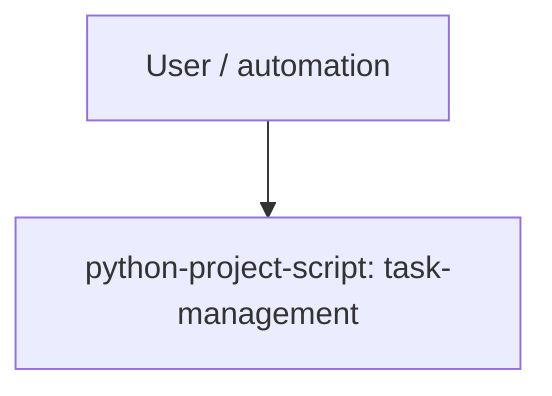

# Runtime Flow: task-management-public-release

- Target repo: `<repo-root>`
- Generated at: `2026-06-13T12:02:13Z`
- Evidence source: manifest/config entrypoint scan by `repo_inventory.py`

## Runtime Entrypoint Diagram

## Detected Entrypoints

| Item | Value |
| --- | --- |
| python-project-script: task-management | `task_management.cli:main` from `pyproject.toml` |

## Inference Notes

- Runtime flow is inferred from manifests and config files only.
- This pass does not execute the application or inspect deployment runtime state.

## Known Gaps

- This first pass does not execute the application.
- Framework routing, background jobs, and deployment-specific behavior require follow-up evidence.
- Runtime confidence details are recorded in `inventory.json` under `analysis_limits.runtime_entrypoints`.
